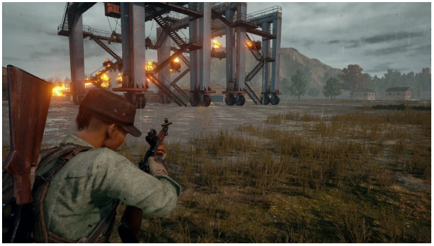
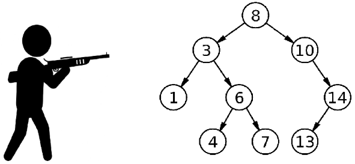
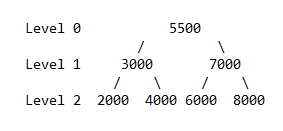

# Soal Praktikum 2 Kelas D
## Daftar Isi
- [Alpha Beta Min Max - ABMM](#alpha-beta-min-max)
- [Galaxy Brain Move - GBM](#galaxy-brain-move)
- [Kiwa Belajar Menghitung - KBM](#kiwa-belajar-menghitung)
- [Yamabuki Bakery - YBK](#yamabuki-bakery)

## Alpha Beta Min Max
| Time Limit | Memory Limit |
|---|---|
| 0.1 seconds | 8 MB |

Hanjing panik karena Gatulngo belum memberikan soal praktikum yang sudh dijanjikannya. Tidak membuang waktu, Hanjing segera membuat soal miliknya sendiri kalau-kalau Gatulngo lupa membuatnya.

Akhir-akhir ini, Hanjing mendapat ilmu baru dalam bidang Kecerdasan Buatan. Ilmu tersebut tertuang dalam algoritma baru: Pruning. Setelah membaca algoritma tersebut, Hanjing tahu bahwa ia tidak bisa membuat soal yang harus menerapkan Pruning. Namun, ia mendapat ide baru. Berikut adalah perintah soal buatan Hanjing:

* Bangunlah sebuah BST.
* Keluarkan satu nilai dari tingkat terbawah sampai tingkat teratas.
* Pengeluarannya berurutan dari nilai minimal, lalu maksimal, lalu minimal, dst.
> Saran: Kerjakan soal ini terlebih dahulu sebelum soal lain. :)

#### Input Format
Input baris pertama adalah N.

Baris berikutnya masukkan N angka.

#### Output Format
Ketentuan sesuai yang tertulis di atas ditambah newline.

#### Sample Input
```c
15
100 50 150 25 75 125 175 12 37 62 87 112 137 162 187
7
500 250 750 125 375 625 875
```
#### Sample Output
```c
12 175 50 100
125 750 500
```
 
#### Constraints
1 ≤ N ≤ 1024 \
1 ≤ Index ≤ 100000

## Galaxy Brain Move
| Time Limit | Memory Limit |
|---|---|
| 0.5 seconds | 8 MB |



Let's play a game.

Seorang player PUBG membutuhkan bantuan untuk mengetahui apakah aksi berani yang ingin dilakukannya akan membuahkan hasil yang diinginkan. Ia ingin membunuh player lain yang berada di sebuah menara bertangga. Menara tersebut terlihat seperti sebuah TREE. Dia berencana menembak mulai dari tingkat paling bawah dari tempat paling kiri. Anggap kecepatan tembak dan reload hampir tidak ada. Sebagai pengamat, kalian lebih tahu nasib player sembrono tersebut.

Si nekat memiliki senapan dengan kapasitas A dan memiliki M magazine. Nekat atau sembrono bisa menembak dan membunuh player lain. Namun bila ia kehabisan peluru setelah dia membunuh seorang player tapi masih ada player lain yang berada di dekatnya, ia akan mati. Hal yang terjadi adalah player terdekat menemukan posisinya dan menembak balik. Tugasmu sebagai observer harus menentukan nasib dari si sembrono.

Kalian merepresentasikan menara tersebut dalam sebuah TREE dengan nilai index node sembarang. Setelah itu, kalian cek apakah si sembrono dapat membunuh K player. Jika bisa, print keluarkan posisi player mana saja yang bisa dibunuh sesuai rencana sembrono.  Jika tidak, keluarkan sebuah kalimat tunggal: "Retard."

#### Input Format
Baris pertama masukan nilai N, kemudian pada baris berikutnya masukkan N nilai sebagai node yang merepresentasikan posisi player di menara. Terus masukkan nilai A dan M pada baris terakhir, kapasitas senapan dan banyak magazine sembrono.

#### Output Format
Jika sukses, keluarkan "A 200 IQ play." dan daftar kill dari sembrono.

Jika gagal, keluarkan "Retard." dengan newline.

#### Sample Input
```c
9
8 3 10 1 6 14 4 7 13
2 0
9
8 3 10 1 6 14 4 7 13
1 0
```

#### Sample Output
```c
A 200 IQ play.
Kill: 4 7
Retard.
```

#### Explanation



Pada kasus pertama, sembrono menembak dua kali dan membunuh 4 dan 7.

Pada kasus kedua, sembrono menembak 4, namun 7 menembak balik.


#### Constraints
1 ≤ N ≤ 10000 \
1 ≤ A ≤ N \
0 ≤ M ≤ A \
1 ≤ Index ≤ 100000

## Kiwa Belajar Menghitung
| Time Limit | Memory Limit |
|---|---|
| 1 seconds | 8 MB |

Kiwa sedang lagi senang-senangnya belajar menghitung. Namun Kiwa hanya suka menjumlah 3 bilangan saja. Kiwa pun meminta kalian membantu dia untuk membantunya menghitung dengan membuatkan program yang dapat menjumlahkan 3 bilangan pada tree dengan syarat ketiga bilangan tersebut bertetangga.

#### Input Format
Baris pertama berupa N dimana N adalah jumlah bilangan yang akan diinput ke tree. Baris kedua berupa bilangan bulat B. Kemudian diikuti X dimana X adalah jumlah dari 3 angka yang dicari di tree.

#### Output Format
Outputkan kata "Ada" apabila X ditemukan di tree. Outputkan "Tidak Ada" apabila X tidak ditemukan di tree.

#### Sample Input #1
```c
10
73 66 91 53 72 77 98 74 78 79
266
```

#### Sample Output #1
```c
Ada
```

#### Sample Input #2
```c
10
73 66 91 53 72 77 98 74 78 79
230
```

#### Sample Output #2
```c
Ada
```
 
#### Explanation


266 berasal dari penjumlahan 91+77+98. Karena 266 bisa dibentuk maka output berupa kata "Ada"

230 berasal dari penjumlahan 73+66+91. Karena 230 bisa dibentuk maka output berupa kata "Ada"

Constraints
1 ≤ N ≤ 100 \
1 ≤ B ≤ 1000

## Yamabuki Bakery
| Time Limit | Memory Limit |
|---|---|
| 1 seconds | 128 MB |


Yamabuki Bakery adalah toko roti terkenal di Jepang. Yamabuki Saaya adalah anak dari pemilik dari toko ini yang setiap hari membantu untuk menyusun roti di tokonya. Yamabuki bakery adalah toko roti yang cukup unik, dimana toko ini memiliki N jenis roti yang masing masing jenis hanya ada 1 stok dan memiliki harga yang unik untuk setiap jenisnya (tidak ada harga roti yang sama). Saaya baru saja belajar tentang BST, ia pun ingin menerapkan prinsip BST untuk penyusunan roti di tokonya. Karna Saaya iseng, ia ingin mencatat setiap rata rata dari setiap level pada tree yang telah disusun olehnya sesuai prinsip BST, karena jumlah rotinya sangat banyak, Saaya pun kewalahan dan memintamu untuk membuatkan program yang dapat mengeluarkan rata rata harga roti pada setiap level. Bantulah Saaya!

#### Input Format
Baris pertama adalah T yaitu jumlah testcase dan diikuti oleh T baris yang berisi N yaitu jumlah roti dan diikuti N baris untuk harga setiap roti.

#### Output Format
Untuk setiap testcase print semua harga rata rata untuk setiap level nya yang dibulatkan hingga 2 angka dibelakang koma (lebih jelasnya cek sample output)

#### Sample Input
```c
1
7
5500
7000
8000
3000
2000
4000
6000
```

#### Sample Output
```c
Level 0 = 5500.00
Level 1 = 5000.00
Level 2 = 5000.00
```

#### Explanation
Tree yang terbentuk adalah


 
sehingga untuk level 0 adalah 5500/1 = 5500, level 1 adalah (3000+7000)/2 = 5000, level 2 adalah (2000+4000+6000+8000)/4=5000

#### Constraints
1 ≤ T ≤ 10 \
1 ≤ N ≤ 10000 \
1 ≤ harga roti ≤ 10000
 
