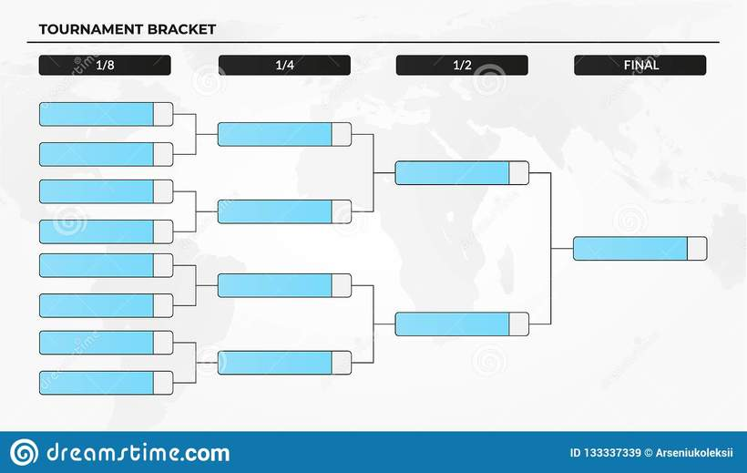

# Soal Praktikum 3 Kelas D
## Daftar Isi
- []()
- []()
- []()
- []()

## Bukan Budokai Tenkaichi
| Time Limit | Memory Limit |
|---|---| 
| 1 seconds | 64 MB |

Kalian diminta membuat sebuah Battle Plan sebuah turnamen.



Bentuk Battle Plan menyerupai sebuah Binary Tree. Akan ada N petarung yang berpartisipasi dalam turnamen.

Bila jumlah N petarung bukan merupakan eksponen 2, maka sisi kanan Battle Plan akan menampung lebih banyak pertarungan.

Tiap petarung memiliki ID masing-masing dan AP yang merupakan kekuatan bertarung mereka. Ketika dua petarung bertanding, pemenang ialah dia yang memiliki AP yang lebih tinggi. Namun, dia akan kehilangan AP sebanyak AP musuhnya. Bila keduanya seri, maka pertarungan dinyatakan selesai tanpa pemenang.

Selain membuat Battle Plan, kalian juga diminta memperkirakan hasil pertarungan tiap ronde turnamen.

Nama petarung berdasarkan ID: https://intip.in/SDNoradier

#### Input Format

Baris pertama diisi N.

Untuk N baris berikut, isi ID dan AP petarung.

#### Contoh:
```c
5
5 300
11 500
17 350
23 135
29 444
```

#### Constraints
* 1 < N, ID < 65
* Jumlah ID = N

#### Output Format

Output berupa baris tunggal berisi "Pemenang pertarungan ke-i: #NamaPemenang" dan diakhiri endline.

#### Contoh:
```c
Pemenang pertarungan ke-1: Cang Bi
Pemenang pertarungan ke-2: Fiora
Pemenang pertarungan ke-3: Enlil
Pemenang pertarungan ke-4: Cang Bi
```

## SIMP!
| Time Limit | Memory Limit |
|---|---| 
| 1 seconds | 64 MB |

Suatu hari, si bucin disuruh sama pacarnya untuk menaruh dan mencari kaset drakor kesayangan si pacarnya, untuk setiap kaset diberi nama yang berupa episode keberapa dari drakor yang ditonton oleh pacarnya, untuk sistem penaruhan/penumpukan sama seperti AVL, si bucin meminta tolong pada anda untuk membuat sebuah program untuk mempermudah bucin dalam melaksanakan perintah dari pacarnya.

#### Input Format
baris integer T adalah testcase

Pada T baris berikutnya adalah string Command yang diikuti oleh integer i adalah episode dari drakor yang dituliskan di kaset

Command hanya berupa "Taro" yang berarti menaruh kedalam tumpukan dan "Cari" yang berarti mencari kaset berada di tumpukan/urutan keberapa

#### Contoh :
```c
11
Taro 100
Taro 74
Cari 100
Cari 70
Taro 152
Taro 21
Taro 33
Cari 100
Cari 21
Cari 1
Liatin 2
```

#### Constraints
* 1 ≤ T ≤ 200000
* 1 ≤ i ≤ 10^6

#### Output Format
Output berupa "Kasetnya ada di tumpukan ke - n" yang dimana n adalah posisi n dalam tumpukan kaset tersebut. Jika ditemukan sebuah command selain "Taro" dan "Cari", maka keluarkan "AKU TUH GATAU HARUS NGAPAIN!"

#### Output dari Input diatas :
```c
Kasetnya ada di tumpukan ke - 2
Kasetnya gak ada!
Kasetnya ada di tumpukan ke - 4
Kasetnya ada di tumpukan ke - 1
Kasetnya gak ada!
AKU TUH GATAU HARUS NGAPAIN!
```

#### Sample Input 0
```c
11
Taro 100
Taro 74
Cari 100
Cari 70
Taro 152
Taro 21
Taro 33
Cari 100
Cari 21
Cari 1 
Liatin 2
```

#### Sample Output 0
```c
Kasetnya ada di tumpukan ke - 2
Kasetnya gak ada!
Kasetnya ada di tumpukan ke - 4
Kasetnya ada di tumpukan ke - 1
Kasetnya gak ada!
AKU TUH GATAU HARUS NGAPAIN!
```

## Luzi Suka Berhitung
| Time Limit | Memory Limit |
|---|---| 
| 1 seconds | 64 MB |

Luzi sangat suka sekali berhitung. Namun kegemarannya ini cukup aneh, dia lebih suka berhitung dari angka yang paling besar ke paling kecil. Dia akan memilih satu angka secara random kemudian lalu mencarinya pada deretan angka yang telah dia buat. Dia akan menjumlahkan urutan angkanya tersebut sampai dia menemukan angka yang dia cari.

#### Input Format

Baris Pertama adalah T

Kemudian T baris berikutnya adalah command dan value

Command 1 yaitu insert dan command 2 untuk mencari value

Apabila value ditemukan maka outputkan indeks value dan jumlah dari dari indeks pertama sampai indeks value tersebut. Jika tidak maka outputkan "Ga Ketemu :("

#### Contoh Input
```c
10
1 10
1 20
1 30
1 40
1 50
1 60
1 70
2 10
2 100
2 70
```

#### Constraints
* 0 <= value < 2 x 10^6

#### Output Format
```c
Jumlahnya: 280
Di urutan: 7
Ga Ketemu :(
Jumlahnya: 70
Di urutan: 1
```

#### Sample Input 0
```c
10
1 10
1 20
1 30
1 40
1 50
1 60
1 70
2 10
2 100
2 70
```

#### Sample Output 0
```c
Jumlahnya: 280
Di urutan: 7
Ga Ketemu :(
Jumlahnya: 70
Di urutan: 1
```

## Maryo Gabut
| Time Limit | Memory Limit |
|---|---| 
| 1 seconds | 64 MB |

Maryo adalah teman luzi. Dia sangatlah gabut, apalagi di masa pandemi seperti ini. Maryo melihat luzi menghabiskan waktunya dengan menghitung. Ia pun tertarik menghitung untuk menghabiskan waktu luangnya. Karena AVL merupakan tree yang auto-balance, ia penasaran berapakah selisih antara parent sebuah node dengan siblingnya (Sibling merupakan child dari parent yang sama). Bantulah maryo menghitung karena ia bingung menghitung setelah kelamaan gabut!

#### Input Format
Baris pertama berisi *N* dan *T*. *N* merupakan jumlah node yang ada di AVL Tree, dan *T* merupakan jumlah kasus yang akan dihitung.

Baris kedua berupa *N* bilangan dalam AVL Tree.

*T* baris berikutnya berisi *1* bilangan *n*, berupa node yang akan dicek.

#### Constraints
* 3 < N, M < 10<sup>3</sup>
* 0 < n < 10 

#### Output Format
Untuk tiap *T* print selisih yang diminta! Jika node yang dicek merupakan root print 

#### Sample Input 0
```c
8 3
6 15 26 27 28 50 17 29
6
17
29
```

#### Sample Output 0
```c
14
20
27
```

#### Explanation 0
Parent dari node 6 adalah 15, siblingnya adalah 29. Sehingga selisih adalah 14. Parent dari node 29 adalah 27, dan tidak memiliki sibling.
