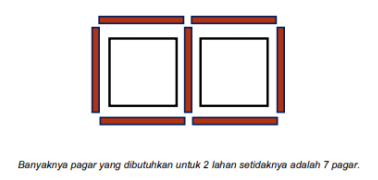
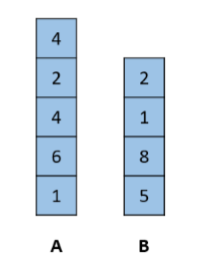
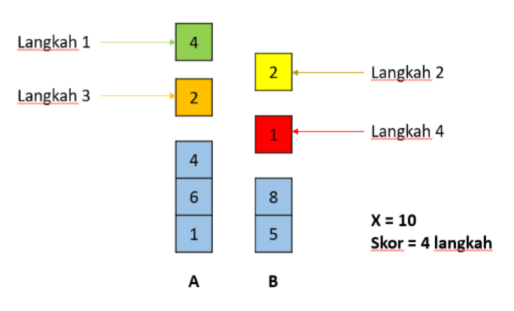

# Soal Praktikum 1 Kelas F
## Special Thanks
Terima kasih untuk semua yang telah membantu untuk menyelesaikan soal-soal ini.
1. Salman Damai Alfariq (Soal, LNR, MBS, MBKK)

## Daftar Isi
- [Brembo dan Lahan Baru - BLAND](#brembo-dan-lahan-baru)
- [Brembo dan RNA Virus - BVIRUS](#brembo-dan-rna-virus)
- [Luffy Nyambung Rantai - LNR](#luffy-nyambung-rantai)
- [Mahmood Bermain Stack - MBS](#mahmood-bermain-stack)
- [MudMud dan Kakaknya - MBKK](#mudmud-dan-kakaknya)

## Brembo dan Lahan Baru
| Time Limit | Memory Limit |
|---|:---|
| 0.4 seconds	| 8 MB |

Challenge \
Selesaikan soal ini tanpa menggunakan operator XOR dan tanpa menggunakan fungsi malloc untuk alokasi dinamis.

Brembo adalah seorang ahli botani dan programmer. Sebagai ahli botani, ia sangat paham betul tentang seluk beluk tanaman dan ditambah lagi hobinya dalam hal pertanian. Brembo sangat berkeinginan menyalurkan hobinya tersebut agar dapat bermanfaat bagi dirinya. Ia ingin mempunyai lahan pertanian yang dikelolanya sendiri untuk dijadikan sebagai tempat penelitian sekaligus memanfaatkannya sebagai perkebunan.

Namun, untuk mewujudkannya, tentu Brembo harus mempunyai lahan. Ia lalu meminta bantuan kepada Ayahnya yang juga seorang petani agar bisa mendapatkan lahan. Ayahnya kemudian memberikan lahan sebanyak ∞ hektare yang tersusun secara horizontal.


Ayahnya menginstruksikan Brembo untuk memasang pagar pada lahan tersebut. Beberapa lahan telah diberikan sebuah bilangan berbeda pi. Bilangan tersebut menunjukkan nilai produktivitas pada lahan ke-i. Untuk membeli pagar, Ayahnya memberikan kesempatan kepada Brembo untuk memilih lahan-lahan dalam interval p[a..b] yakni pa, pa+1, pa+2, ..., pb. Jika n adalah banyaknya lahan dari p[a..b], maka Brembo harus memilih lahan sedemikian hingga n > 1. Kemudian, dari lahan  yang dipilih, Brembo diharuskan untuk memilih dua lahan px dan py yang mana px dan py masing-masing adalah nilai produktivitas terbesar dan terbesar kedua. Uang untuk membeli pagar dihasilkan dari px **xor** py.



Brembo ingin membangun pagar pada lahan sebanyak mungkin. Jika Ayahnya hanya memberikan nilai produktivitas pada N buah lahan (N lahan pasti berdampingan), maka berapa banyak lahan yang bisa dibangun pagar?

#### Input Format
Input terdiri dari beberapa kasus uji. Baris pertama adalah T, yakni banyaknya kasus uji. Untuk setiap kasus uji, terdapat dua baris.

Bilangan N yang menyatakan banyaknya lahan yang diberi nilai produktivitas.
Nilai produktivitas lahan p1, p2, p3, ..., pN  (dipisahkan spasi).
#### Output Format
Cetak string “Kasus #x: “ diikuti dengan jawaban yang dimaksud pada deskripsi untuk setiap kasus uji. Bilangan x  dimulai dari 1.

#### Sample Input
```c 
2
3
1 2 5
5
7 8 4 5 1
```
#### Sample Output
```c
Kasus #1: 2
Kasus #2: 4
```
#### Constraints
1 ≤ T ≤ 100 \
1 < N ≤ 1000000 \
1 ≤ pi ≤ 108, pi ≠ pj, untuk i ≠ j


## Brembo dan RNA Virus
Time Limit	0.5 seconds
Memory Limit	16 MB
Kombinasikan penggunaan 4 struktur data sekaligus (stack, queue, priority queue, dynamic array/linked list) dalam soal ini. Masing-masing struktur data harus mempunyai kegunaan spesifik masing-masing. \
Sekelompok ilmuwan dari Tece 19 Institute yang dipimpin oleh Brembo telah menemukan M buah virus yang sangat unik. Setelah diteliti lebih lanjut, ternyata komponen basa penyusun RNA (Ribonucleic Acid) dari virus-virus tersebut berbeda. Basa penyusunnya terdiri dari X, Y, A dan B. Masing-masing dapat membentuk pasangan basa dengan kemungkinan :

- Basa X hanya bisa berpasangan dengan basa Y. \
- Basa A hanya bisa berpasangan dengan basa B. 

Berikut adalah salah satu contoh sekuens RNA dari sebuah virus.


Saat virus aktif, RNA tersebut akan melakukan suatu mekanisme untuk membuat pasangan basa sebanyak mungkin. Mekanismenya adalah : 
- Suatu basa hanya dapat membuat pasangan pada basa lain apabila kedua basa letaknya berdampingan. 
- Jika suatu basa ingin membentuk dengan pasangan basa lain yang letaknya tidak berdampingan, maka koneksi dapat dilakukan melalui pasangan basa lain yang telah aktif. 

Sekuens RNA di atas dapat membentuk pasangan basa dengan cara : 

- XY berdampingan, maka bisa membentuk pasangan.


- Kemudian AB berdampingan, maka bisa membentuk pasangan.


- XY (berwarna kuning) dapat berpasangan karena membentuk koneksi melalui AB yang sebelumnya telah aktif. Lalu AB (berwarna hijau) dapat berpasangan.


- Hingga pada akhirnya dapat membentuk 5 pasang basa.


Brembo ingin semua M  virus untuk diteliti di sebuah fasilitas penelitian. Fasilitas tersebut mempunyai N buah ruang laboratorium dengan nomor 1 hingga N. Masing-masing laboratorium membutuhkan waktu selama ti  untuk mengidentifikasi satu pasang basa dari sebuah virus. Karena jumlah ruang lab. terbatas, semua virus bisa saja tidak dapat diidentifikasi secara bersamaan. Jika hal ini terjadi, apabila ada ruang lab. yang kosong (tidak sedang mengidentifikasi), maka **virus selanjutnya akan diidentifikasi pada ruang lab. yang mempunyai nomor terkecil.**

Sekuens RNA direpresentasikan sebagai string dengan kumpulan karakternya adalah basa penyusun RNA. Brembo memutuskan untuk membuat program untuk menghitung berapa total waktu yang dibutuhkan untuk mengidentifikasi M virus.

#### Input Format
Input dideskripsikan sebagai berikut.

- Baris pertama adalah N.
- Baris kedua terdapat N bilangan ti.
- Baris ketiga adalah M.
- M baris berikutnya berisi sebuah string sekuens RNA. 
Urutan sekuens RNA yang masuk berdasarkan urutan input. 

#### Output Format
Satu bilangan yakni total waktu yang dibutuhkan untuk mengidentifikasi M virus.

#### Sample Input
```c
2
1 2
3
ABXXYYAX
XYXABYYBAXXA
AB
```
#### Sample Output
```c
10
```

#### Constraints
1 ≤ ti ≤ 100 \
Panjang sekuens maks. 200 karakter.

## Luffy Nyambung Rantai
| Time Limit | Memory Limit |
|---|:---|
| 1 seconds	| 128 MB |


Pada suatu hari, rantai di kapal luffy tiba-tiba rusak. Saat ia ingin menyambung kembali rantainya, ternyata rantai-nya harus terpasang berurutan dari kecil ke besar dan anak rantainya tercampur dengan rantai yang lain. Bantu Luffy memasang rantai itu. Nb : Tidak boleh ada angka yang muncul lebih dari satu.

#### Input Format
Beberapa bilangan bulat yang harus dimasukkan ke list sampai menemui -1. (-1 tidak dimasukkan ke list)

#### Output Format
Keluarkan urutan anak rantai dari kecil ke besar dan tidak ada angka yang muncul lebih dari satu.

#### Sample Input
```c
1 4 1 3 4 10 5 -1
```
#### Sample Output
```c
1 3 4 5 10
```
#### Constraints
anak rantai dalam range integer


## Mahmood Bermain Stack
Time Limit	1 seconds
Memory Limit	128 MB
Sebelum wawancara asisten dosen Struktur Data, Mahmood mencoba belajar konsep stack dengan bermain sebuah permainan. Permainan tersebut melibatkan dua buah stack dengan nilai-nilai tertentu sebagai elemen kedua stack tersebut.

Dua buah stack tersebut melibatkan stack A dan B, dengan sebuah integer sebagai elemennya

A = [a1,a2,a3,...,an]

B = [b1,b2,b3,...,bn]

Karena Mahmood merasa menumpuk stack terlalu mudah, maka ia meningkatkan kesulitan permainannya dengan memberi dirinya tantangan:

Top dari kedua stack tersebut adalah elemen pertama \
Mahmood hanya bisa mengambil (pop) salah satu top dari kedua stack di setiap langkah \
Mahmood juga harus menghitung jumlah nilai elemen top yang ia ambil (pop) dari stack pada setiap langkah \
Jumlah nilai elemen top yang sudah Mahmood kumpulkan tidak boleh melebihi sebuah nilai x yang telah ditentukan di awal \
Skor akhir Mahmood adalah berapa kali ia melakukan pop terhadap stack tersebut \
Dengan diberikan stack A dan B, serta sebuah integer x sebagai batas jumlah, bantulah Mahmood mendapatkan skor tertinggi.

Catatan : Gunakan konsep stack, queue, dan dequeue, menggunakan array tetap sah selama mengikuti aturan stack, queue, dan dequeue dimana TIDAK MELAKUKAN TRAVERSAL ke elemen selain yang diketahui

#### Input Format
Baris pertama adalah N banyak testcase

-untuk setiap N testcase:

nA nB x, dimana nA dan nB adalah banyak stack A dan B berurutan, serta x adalah nilai batas jumlah \
az sebanyak nA yang merupakan elemen dari stack A \
bz sebanyak nB yang merupakan elemen dari stack B \
#### Output Format
Untuk setiap testcase, outputkan skor Mahmood diikuti endline ('\n')

#### Sample Input
```c
1
5 4 10
4 2 4 6 1
2 1 8 5
```
#### Sample Output
```c
4
```

#### Explanation
Pada awalnya, stack Mahmood terlihat seperti ini



dengan x = 10, maka Mahmood hanya bisa melakukan pop sebanyak 4 kali tanpa membuat jumlahnya melebihi x



Mahmood hanya bisa melakukan pop sebanyak 4 kali pada elemen 4 2 2 1 dengan jumlah 4+2+2+1 = 9 agar tidak melebihi angka 10

Contoh langkah pengambilan stack pada soal hanya salah satu contoh langkah, tidak terpaku pada urutan a-b-a-b, bisa a-a-b-b atau b-b-a-a 

#### Constraints
1 ≤ N ≤ 50 \
1 ≤ nA,nB ≤ 100000 \
0 ≤ ai,bj ≤ 100000 \
1 ≤ x ≤ 100000

## MudMud dan Kakaknya
| Time Limit | Memory Limit |
|---|:---|
| 1 seconds	| 8 MB |


MudMud sangat menyayangi kakaknya. Suatu ketika MudMud ulang tahun dan diberi hadiah setumpuk roti yang dinomori dari 1-N (dari atas) oleh ibunya. Ibunya berhak memindah roti satu per satu dari tumpukan roti MudMud ke tumpukan kakaknya, atau dari tumpukan kakaknya ke tumpukan MudMud. MudMud harus memiliki jumlah yang sama dengan kakaknya. Jika roti yang dimiliki MudMud lebih sedikit dari yang dipunyai kakaknya, MudMud akan marah. Tapi jika roti yang dimiliki kakaknya lebih sedikit dari yang dipunyai MudMud, MudMud akan kasihan. Jika mereka berdua tidak diberi roti, maka MudMud akan sangat marah.

#### Input Format
Baris pertama adalah N, yaitu jumlah roti. Baris kedua adalah T, jumlah ibunya dapat memindahkan roti. T baris berikutnya adalah Ai dan Bi. Jika Ai = 1 berarti ibunya memindah dari tumpukan MudMud ke tumpukan kakaknya, jika Ai = 2 berarti sebaliknya. Bi adalah banyaknya tumpukan yang dipindah (memindahkannya harus satu per satu)

#### Output Format
Tampilkan tumpukan roti MudMud dan tumpukan roti kakaknya. Jika tumpukan MudMud lebih sedikit keluarkan "MudMud Marah!" diatas tumpukan roti MudMud. Jika lebih banyak keluarkan "MudmuD KasihAn!" diatas tumpukan roti kakaknya. Jika mereka tidak mendapat tumpukan roti keluarkan "MudMud SangaT MaraH!". Jika instruksi salah, berhenti memproses dan keluarkan "TumpukAnnya saLah! :(". '\t\t' untuk 2x tab agar tumpukannya rapi.

#### Sample Input
```c
5
5
1 1
1 2
1 1
2 1
2 2
```
#### Sample Output
```c
2             1
3             MudmuD KasihAn!
4        
5        
```
#### Sample Input
```c
5
2
1 2
1 2
```
Sample Output
```c
5             4
MudMud Marah! 3
              2
              1
```
#### Explanation
-

##### Constraints
0<=N,T,B<=100
